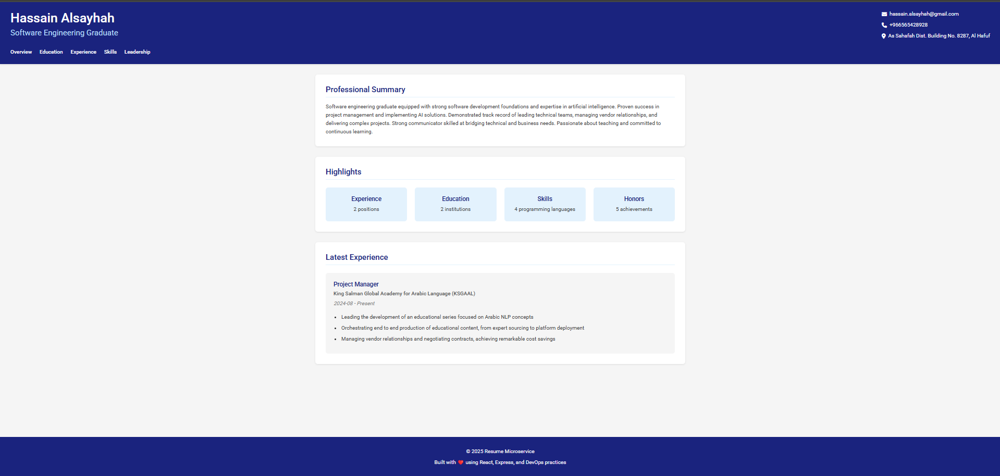
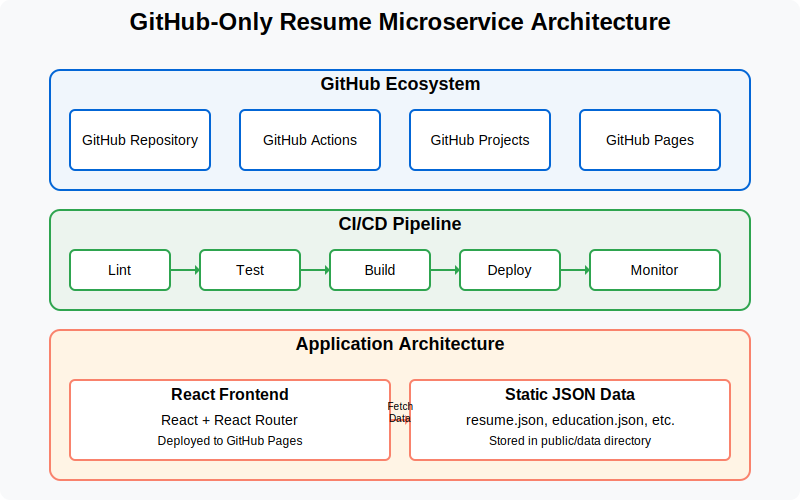
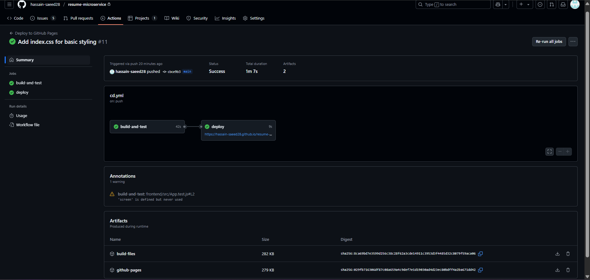

# Resume Microservice with GitHub DevOps

## Project Overview

This project implements a cloud-based resume microservice using DevOps practices exclusively within GitHub's ecosystem. The application provides a responsive, interactive resume website that fetches data from static JSON files, all deployed using GitHub Pages and automated with GitHub Actions.

**Live Demo:** [https://hassain-saeed28.github.io/resume-microservice](https://hassain-saeed28.github.io/resume-microservice)



## Project Status

✅ **Fully Implemented and Deployed**

- Frontend React application built and deployed to GitHub Pages
- CI/CD pipeline configured and operational
- Static JSON API implemented
- Project management with GitHub Projects completed
- All DevOps requirements satisfied

## Team Structure

- **Hassain Alsayhah** - Project Lead, Developer
- **Ahmed Almohammed**- CI/CD Engineer
- **Abdulmohsen Al Ali** - Operations/QA Analyst

## Architecture



The system follows a simplified architecture with the following components:

- **Frontend**: A React-based SPA that displays resume data in an interactive format
- **Static API**: JSON files served directly from GitHub Pages
- **CI/CD Pipeline**: GitHub Actions for automated testing, building, and deployment
- **Deployment**: GitHub Pages for hosting both the frontend and static API

### GitHub-Only Approach

We made a deliberate architectural decision to implement this project using only GitHub services, specifically:

1. **Static JSON Instead of Backend Server**:

   - Resume data is stored in JSON files in the `public/data` directory
   - This eliminates the need for server maintenance, database configuration, and API programming
   - Simplified architecture while maintaining separation of concerns

2. **GitHub Pages for Hosting**:

   - Single platform hosts both the application and its data
   - Zero infrastructure management required
   - Automated deployment tied directly to our GitHub Actions workflow

3. **GitHub Actions for CI/CD**:
   - Automated testing runs on every pull request
   - Build verification ensures the application builds correctly
   - Deployment automation pushes to GitHub Pages when changes merge to main

This approach demonstrates how DevOps principles (automation, continuous integration, continuous deployment) can be applied even with a simplified architecture while meeting all project requirements.

## Technology Stack

- **Frontend**: React.js, React Router, HTML5, CSS3
- **Data Storage**: Static JSON files
- **Testing**: Jest for unit testing
- **CI/CD**: GitHub Actions
- **Deployment**: GitHub Pages

## Key Features

- **Responsive Design**: Optimized for both desktop and mobile
- **Interactive UI**: Clean, modern interface with easy navigation
- **Component-Based Architecture**: Modular React components for maintainability
- **Automated Pipeline**: Changes automatically tested and deployed

## DevOps Practices Implemented

This project implements DevOps practices including:

1. **Continuous Integration**:

   - Automated linting and testing on every pull request
   - Code quality checks before merging
   - Immediate feedback on code changes

2. **Continuous Deployment**:

   - Automated deployment to GitHub Pages
   - Deployment on successful merges to main branch
   - Zero manual deployment steps

3. **Version Control Strategy**:

   - Feature branches with pull request reviews
   - Protected main branch
   - Detailed commit messages with issue references

4. **Automated Testing**:

   - Unit tests for React components
   - Test coverage maintained
   - Tests automatically run in CI pipeline

5. **GitHub Ecosystem Integration**:
   - GitHub Projects for task management
   - GitHub Issues for tracking work
   - GitHub Actions for automation
   - GitHub Pages for deployment

## CI/CD Pipeline

Our CI/CD pipeline consists of the following stages:

1. **Lint**: Ensures code follows style guidelines
2. **Test**: Runs unit tests to verify functionality
3. **Build**: Creates optimized production build
4. **Deploy**: Publishes to GitHub Pages



## Getting Started

### Prerequisites

- Node.js v18+
- GitHub account

### Local Development

```bash
# Clone the repository
git clone https://github.com/hassain-saeed28/resume-microservice.git
cd resume-microservice

# Install dependencies
cd frontend
npm install

# Start development server
npm start
```

### Running Tests

```bash
# Run unit tests
npm test

# Run linting
npm run lint
```

## Project Structure

```
resume-microservice/
├── .github/
│   └── workflows/       # GitHub Actions workflow definitions
├── docs/                # Documentation files and images
├── frontend/
│   ├── public/
│   │   ├── data/        # JSON resume data files
│   │   └── index.html   # HTML template
│   └── src/
│       ├── components/  # React components
│       ├── pages/       # Page components
│       ├── services/    # API service
│       └── App.js       # Main application component
└── README.md            # Project documentation
```

## Challenges and Solutions

During development, we faced several challenges:

1. **Challenge**: Setting up CI/CD with GitHub Actions

   - **Solution**: Created a properly configured workflow file with appropriate permissions and artifact handling

2. **Challenge**: Testing configuration

   - **Solution**: Implemented basic unit tests with proper mocking for React Router and API calls

3. **Challenge**: Deployment to GitHub Pages
   - **Solution**: Configured the correct base URL and routing strategy for GitHub Pages hosting

## Project Board

Track our progress on the [GitHub Project Board](https://github.com/hassain-saeed28/resume-microservice/projects/1)

## Future Improvements

- Add dark/light theme toggle
- Implement PDF export functionality
- Add localization support for multiple languages
- Enhance mobile experience with responsive optimizations
