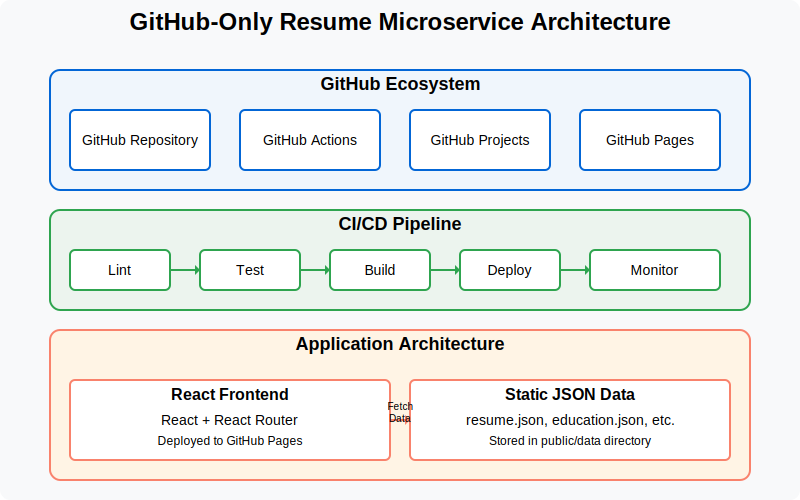

# GitHub-Only Architecture

## Overview

This document explains the architectural decision to implement our resume microservice using exclusively GitHub's ecosystem, rather than deploying a traditional backend server on a separate platform.

## Architecture Components



Our architecture consists of the following components:

### 1. Static JSON Data

Instead of implementing a traditional database and API backend, we store all resume data as static JSON files:

```
frontend/public/data/
├── education.json
├── experience.json
├── leadership.json
├── resume.json
└── skills.json
```

These JSON files serve as our "database" and are:

- Version-controlled alongside our application code
- Deployed automatically with GitHub Pages
- Easily updated through the normal Git workflow

### 2. React Frontend

Our frontend application is built with React and:

- Fetches data directly from the static JSON files
- Handles all presentation logic
- Manages routing with React Router
- Provides a responsive, interactive user experience

### 3. GitHub Pages Hosting

GitHub Pages hosts both our:

- React application (HTML, CSS, JavaScript)
- Static JSON data files

This approach provides several benefits:

- Zero server management overhead
- Automatic CDN distribution
- Free hosting tier
- Simplified deployment process

### 4. GitHub Actions for CI/CD

Our CI/CD pipeline is implemented entirely with GitHub Actions:

```yaml
name: Deploy to GitHub Pages

on:
  push:
    branches: [main]
  pull_request:
    branches: [main]

jobs:
  build-and-test:
    # Job configuration...

  deploy:
    # Deployment configuration...
```

This workflow:

- Runs linting and testing
- Builds the React application
- Deploys to GitHub Pages

### 5. GitHub Projects for Task Management

We use GitHub Projects for:

- Task tracking
- Sprint planning
- Progress visualization
- Team coordination

## Advantages of GitHub-Only Approach

1. **Simplified Architecture**:

   - Eliminating the backend reduces complexity
   - Fewer points of failure
   - Simplified mental model

2. **Reduced Infrastructure Costs**:

   - No server hosting costs
   - No database management
   - No scaling concerns

3. **Enhanced Developer Experience**:

   - Single platform for all project aspects
   - Unified authentication and permissions
   - Streamlined workflows

4. **Faster Deployment**:

   - Direct deployment from repository
   - No separate deployment configurations
   - Automatic HTTPS and CDN

5. **Improved Security**:
   - Reduced attack surface
   - No sensitive backend to protect
   - GitHub's enterprise-grade security

## Challenges and Mitigations

1. **Challenge**: No dynamic data processing

   - **Mitigation**: Frontend handles all data manipulation

2. **Challenge**: Limited data update workflows

   - **Mitigation**: Git-based workflow for updates

3. **Challenge**: No server-side rendering

   - **Mitigation**: Optimized static builds and code splitting

4. **Challenge**: Client-side only authentication
   - **Mitigation**: Not needed for public resume data

## DevOps Principles Applied

Despite the simplified architecture, this approach still demonstrates key DevOps principles:

1. **Continuous Integration**: Automated testing on all code changes
2. **Continuous Deployment**: Automated deployment to production
3. **Infrastructure as Code**: Workflow configuration as YAML
4. **Version Control**: All code and data in Git
5. **Automated Testing**: Unit tests run in CI pipeline

## Conclusion

The GitHub-only approach demonstrates that DevOps principles can be applied even with simplified architectures. This approach is particularly well-suited for static content like resumes, and showcases how modern web development can leverage GitHub's ecosystem to create efficient, maintainable applications with minimal infrastructure overhead.
